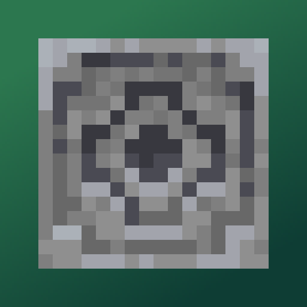
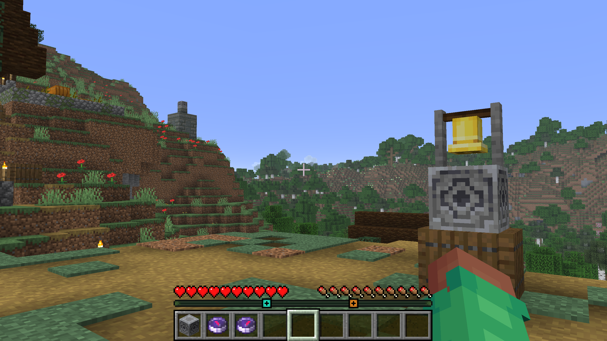

# Locator Lodestones

[Modrinth Page](https://modrinth.com/project/pMBcsVIg)



Adds Waypoints to the Player Locator Bar for each Lodestone Compass and Recovery Compass in your inventory.

The mod works entirely client-side, and doesn't need to be installed on the server.

If the compass has an RGB code in its name (for example, a compass named "Home #00FF8F"),
it will use that color for the waypoint.
Otherwise, the color is randomly determined based on the coordinates of the lodestone.

The names of compasses (minus any RGB codes) can be shown above the bar by holding down the player list key (by default TAB)

The mod also checks bundles, so you can place all of your compasses in a bundle, and it will still work.



[Download on Modrinth](https://modrinth.com/project/pMBcsVIg)

# Additional features from this fork

Only consider compasses held by the player within a configurable location:
- whole inventory (default),
- hotbar only,
- hands only.

Optionally adds a compass dial to the locator bar: 
- showing cardinal directions (north ↑, south ↓, west ←, east →)
- showing divisions to estimate angles in between
- displayed when the player has a compass (even if not linked to a lodestone) or a recovery compass
- under a new config option (false by default)


Display the distance to the waypoint the player is aiming at:
- only within a +/-10° angle accuracy
- using the waypoint color
- when shown, the experience level is hidden
- working for standard entity waypoints and lodestone waypoints
- under a config option (false by default)


Display spawn point on locator bar:
- when holding a non-lodestone compass
- under config option (default to false)


Display map's points of interest as waypoints on the locator bar:
- when holding a filled map
- under config option


Clock held by player chime at night time :
- location configurable (default inventory)
  - inside bundles included (if enabled by config)
- it plays a chime sound (configurable) at the end of every day
- only works in overworld (when the clock itself works)

<hr/>

Configuration file format has been updated as follows (default values shown):
```
{
  "tab_forces_locator_bar": true,
  "tab_shows_names": true,
  "holding_location": "inventory",
  "show_bundled_compasses": true,
  "show_compass_dial": false,
  "show_recovery_compasses": true,
  "show_spawn": false,
  "show_maps": false,
  "show_distance": false,
  "show_in_spectator": false,
  "colors": {
    "lodestone_color": "random",
    "recovery_color": "bce0eb",
    "spawn_color": "6bcf6d",
    "dial_color": "879e7b",
    "color_customization": true
  },
  "clock_location": "inventory",
  "clock_sound": {
    "sound_id": "minecraft:block.note_block.chime"
  }
}
```
